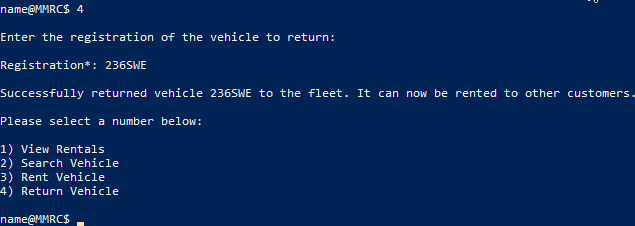

# Mates-Rates Rent-a-Car – User Manual

>*I bet you won't even return it with a full tank...*

### Lewis Watson (n10221131)
### CAB201 - Semester 1, 2020

---

## A brief overview

The 2004 founding of a small site called Facebook in Harvard dorm rooms. The ruthless *extend, embrace, extinguish* of Gates' 1990s Microsoft. The pivot from book sales to something bigger by Amazon's Jeff Bezsos in the late 1990s. These were all important time periods to the modern tech world as we know it. Now, you get to take part in the next game changer – MRRC.

## Getting started

You will need a few things to run MRRC if you do not already have them:
- Visual Studio 2019
- A computer running Windows 10
- Keyboard and mouse input
- Vision (sorry I don't think I was too friendly for accessibility this time around)

Firstly, you will want to navigate to the project's root folder (see *Directory Structure*). Open `MRRC.sln`, which is the solution, in Visual Studio 2019. From here, you will be presented with two distinct folders, named `MRRC` and `MRRCManagement`. You want to build & run `MRRCManagement` as this project contains the user interface (whereas `MRRC` only contains agnostic backend functionality).

Upon entering, you will be prompted to enter your name. This name will be used through the menu, to give off a similar feeling to any other terminal. Please enter your name and press enter. You will now be in the main application.

## Specifying Data Directory

MRRC uses three separate `.csv` files to save and load data from. These are, by default, located in the `\Data` directory. However, you can pass three separate arguments when launching the programme that allow you to specify a custom data directory. Not supplying these will just use the defaults.

## Main Menu

You will be greeted with `name@MRRC $ ` where name is the name you entered at the start. From here, you should be presented with a menu with three options, like this:


These will be:
```
1) Customer Management
2) Fleet Management
3) Rental Management
```

You must enter the number of the option that you want to select, followed by pressing enter. This will take you into the menu you have selected. From any menu, except where you are entering data, you are able to press any of the shortcut keys (*see Shortcut Keys* in the glossary) to do something.

Pressing 1 followed by enter will take you to the customer management menu. As with pressing 2 will take you to the fleet management menu. And of course, pressing 3 will take you to the rental management menu. Any other option is invalid and will not do anything. You are free to press enter as many times as you want - it will not exist the programme.

## Customer Management

This is the place to manage everything to do with MRRC's customers. There are 4 distinct actions: viewing customers, adding customers, editing customers and removing customers.

The same process applies as on the main creen. You will be presented with a few numbered options. Enter a number and press enter to dive in!


Each customer has a unique ID. When you create a new customer, you are not able to specify an ID. You can however change their ID afterwards should you please. We do not recommend altering IDs too much as you may experience adverse effects if done enough. **Please take caution and use common sense.**

There are a few data contraints we need to go over too!

| Name      | Options     |
| --------- |:------------: |
| `Gender`      | `Male` or `Female` or `Other` |
| `DOB`      | `dd/mm/yyyy` |

Yes, the day comes before the month. **Americans go away!!!!** Your DOB must always be in that form - even if you are born on the 3rd of February (you will enter `03/02/2020`, for example).

You can view all your customers in the CRM by pressing `1` at the customer management menu. A table like this will display.


You can also edit any of a customer's information as you please too. So no need to worry if you make any mistake when adding them. Just navigate to the customer management menu, and enter `3` to edit a customer. Just make sure you know their ID!


Take note: when adding customers, the fields marked with an asterisk (*) require you must enter something. Fields without an asterisk can be left blank to use the defaults. When editing customers, leaving fields blank will just use the customer's existing data.


## Fleet Management

From the main menu, pressing `2` will take you to the fleet management part of the software. Like with customers, you can view your fleet, edit specific vehicles, add new vehicles or remove your older ones.


Each vehicle has a unique registration. This consists of three numbers followed by 3 capital letters. *Vanity plates are for vain losers*. Some examples are below:

| Correct       | Incorrect     |
| ------------- |:------------: |
| `236WVO`      | `236wvo` `wv0236` `236WV0` |
| `353JAA`      | `jar jar binks`, `threefivethreejayayeaye` |

There are also a few types of grade, transmission, fuel and options you can choose from:

| Name      | Options     |
| --------- |:------------: |
| `Grade`      | `Luxury` or `Commercial` or `Economy` or `Family` |
| `Fuel`      | `Petrol` or `Diesel` |
| `Transmission`  | `Automatic` or `Manual` |
| `GPS`  | `yes` or `no` |
| `Sunroof`  | `yes` or `no` |

- `Year` must also be greather than 1769 (the disputed date of the first powered vehicle on wheels - good luck finding one or registering one though!)
- `Seats` must also be between `2` and `10` (inclusive)
- `Daily Rate` can be a decimal, or a normal number (ie: `20`, `25.34`, etc). Don't put a dollar sign there though!

Pressing `1` at the fleet management menu will display a table of all the vehicles within the fleet. Depending on your window size, you may need to resize the console window to fit everything nicely (it does not line wrap nicely.)


Pressing `2` will take you to the input menu where you can add a new vehicle. Registration is mandatory for you to specify, unlike the customer. You must put it in the format as specified above. Don't worry if you make a mistake though, because the programme will tell you so.


There are 4 different grades of vehicle: luxury, economy, family and commercial. Each have their own default values if you do not specify. For example, luxury vehicles cost more to rent per day than an economy vehicle would normally. Commercial vehicles are diesel by default. So beware when adding vehicles!


Pressing `3` will take you a menu where you may edit vehicles. You simply need to specify the registration code of the vehicle you want to edit. From there, you can choose to change any of the available fields.


You can also delete vehicles based on their registration too. Simply press `4` on the fleet management menu, and enter the registration you want to delete. That vehicle will promptly be removed from the fleet. Don't worry if you enter a registration that isn't correct, because the programme can't delete a vehicle that does not exist!


## Rental Management

From the main menu, pressing 3 will take you to the rental management view. Here you manage anything and everything to do with rental vehicles in the MRRC universe. You can view which vehicles are currently being rented, rent a vehicle out to a customer, return a vehicle to the fleet and search for vehicles.


Pressing `1` will display a table of all current rentals, including the registration, who is renting them and what the daily cost is. You can view more details about the customers through the customer management menu, and you can view more information about the vehicles themselves through the fleet management menu.


Pressing `2` at the rental menu will open a search dialog. Here you can enter any number of search terms, with any number of groupings. Consider it like maths.

You can search for blue vehicles with 4 seats that come with an automatic transmission like this:
```
Search*: Blue AND 4-seater AND Automatic
```

You can search for vehicles that are either diesel and black, or for a vehicles that a petrol and white like:
```
Search*: (Diesel AND Black) OR (Petrol AND White)
```

Take this to the n-th degree and you can nest brackets, as well as search for vehicles with spaces in their model names like this:
```
Search*: Automatic OR (Black AND (Petrol OR "Fiero 2M4"))
```

The limit here is entirely your own imagination! Search for what your heart desires.

The results from your search will look something like this, a simple table:


If your query returns no results, the program will let you know with a simple message. No need to fear. Consider loosening your search critera.

Pressing `3` will allow you to rent a vehicle that is being rented. All you need is the customer ID, the 6-digit registration number of the vehicle, and how many days you want the rental to last.


The program will display the full amount of the rental and ask for your confirmation on whether to go ahead. This is a simple "y" or "n" answer.

Pressing `4` will allow you to specify a vehicle to return. All you need to do is enter the registration of the vehicle in question.



## Persisting Changes

If you have made changes to the CRM or the fleet, they will **NOT** automatically be saved. You have to explicitly save them yourself. So please exit the programme with `q` only to save your changes. Exiting any other does not guarantee your changes will be saved. While pressing the 'X' will attempt to save, it cannot always be guaranteed.

If you edit a vehicle, for example, and press `1` in the fleet management menu, you will see the vehicle with its updated data. But this is not saved to the disk yet!

There is no `ctrl + z` in the land of MRRC! So if you make a mistake, you can press `ctrl + c` and those mistakes won't be there. But be careful if you have done anything else that you may want to keep - because it will be lost too.

## Glossary

### Shortcut Keys

There are a set of keys that from any option menu, will navigate you accordingly within the programme. These cannot be used within input menus (eg: adding a vehicle, editing a customer, etc).

| Key           | Functionality                               |
| ------------- |:------------------------------------------: |
| `q`           | Quits programme safely, saving all changes. |
| `h`           | Takes you to the home menu (or main menu).  |
| `p`           | Takes you up to the parent level menu.      |

### Directory Structure

```
MRRC/
    |
    - Data/
        |
        - customers.csv
        - fleet.csv
        - rentals.csv
    - Documentation/
        ...
    - MRRC/
        |
        - Application/
        - Domain/
        - Infrastructure/
        - Program.cs
    - MRRCManagement/
        |
        - Displayable/
        - Handler/
        - Validator/
        - Program.cs
    - MRRC.sln
    - n10221131_Part_A_Extension_Information.pdf
    - n10221131_Part_B_Extension_Information.pdf
```